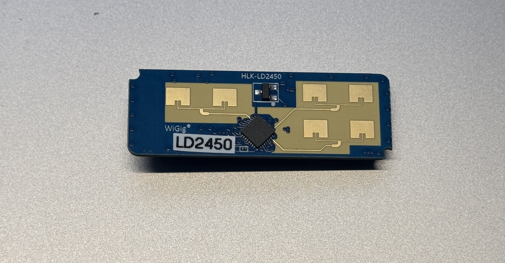

## LD2450 24Ghz Human Radar




Arduino library for HLK-LD2450 24Ghz Human body Motion Inductive Radar Sensor Module Kit

An Arduino library for the Hi-Link HLK-LD2450 24Ghz FMCW radar sensor. This sensor is a Frequency Modulated Continuous Wave radar, which makes it good for presence detection and has some interesting new features, including precise target location of three objects at the same time.

The LD2450, as sold for configuration with the common breakout boards shown above communicates over serial at 256000 baud by default. This library allows you to configure and use the sensor over this serial connection. As the LD2450 is a device that uses a high baud rate, a microcontroller with a spare hardware UART for this communication is preferable to bit-banged software serial.


## API

```c++
    void begin(Stream &radarStream);
    void begin(SoftwareSerial &radarStream, bool already_initialized = false);
    void begin(HardwareSerial &radarStream, bool already_initialized = false); // setup sensor with given Hardware Serial instance such as Serial1
    void setNumberOfTargets(uint16_t _numTargets); // how many targets should be parsed - limit is three on current ld2450 firmware
    RadarTarget getTarget(uint16_t _target_id); // get a target by number from 0 - getSensorSupportedTargetCount()
    uint16_t getSensorSupportedTargetCount();
    String getLastTargetMessage(); // get debug message - see basic example
    uint8_t read(); // handle serial data stream, must be called in loop
```

```c++
    typedef struct RadarTarget
    {
        uint16_t id;         // TARGET ID 1-3
        int16_t x;           // X mm
        int16_t y;           // Y mm
        int16_t speed;       // cm/s
        uint16_t resolution; // mm
        uint16_t distance; // mm
        bool valid;
    } RadarTarget_t;
```

## MINIMAL EXAMPLE

### WIRING

| LD2450 | RASPBERRY PI PICO |
|--------|-------------------|
| 5V     | VBUS              |
| GND    | GND               |
| TX     | GPIO1 / GP1       |
| RX     | GPIO0 / GP0       |

### EXAMPLE CODE

```c++
    #include <LD2450.h>
    void setup()
    {
        //SERIAL FOR DEBUG MESSAGES
        Serial.begin(115200);
        // SETUP SENSOR USING HARDWARE SERIAL INTERFACE 1
        ld2450.begin(Serial1, false);  
    }

    void loop()
    {
        if (ld2450.read() > 0)
        {
            Serial.print(ld2450.getLastTargetMessage());
        }
    }
```

## DISCLAIMER AND NOTES

The library is based on the following projects:

* https://github.com/arduino/Arduino/wiki/Library-Manager-FAQ
* https://github.com/0ingchun/arduino-lib_HLK-LD2450_Radar/.
