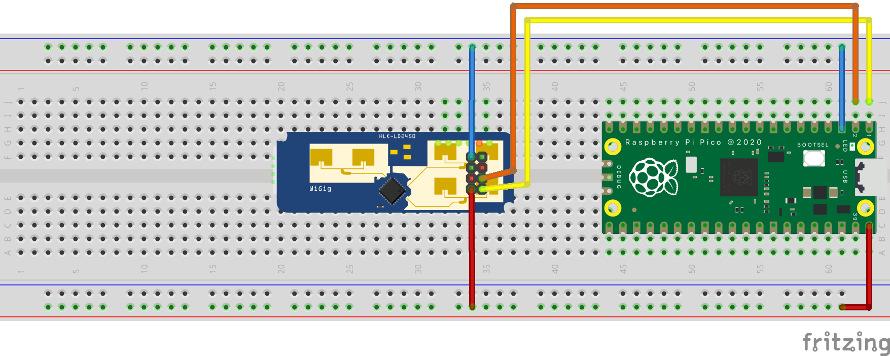
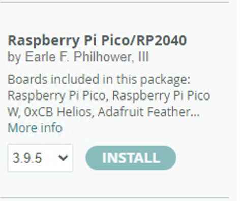

## LD2450 24Ghz Human Radar

Arduino library for `HLK-LD2450 24Ghz Human body Motion Inductive Radar Sensor Module Kit`


An Arduino library for the `Hi-Link HLK-LD2450 24Ghz FMCW radar sensor`. This sensor is a Frequency Modulated Continuous Wave radar, which makes it good for presence detection and has some interesting new features, including precise target location of three objects at the same time.

## HARDWARE REQUIREMENTS

The `LD2450`, as sold for configuration with the common breakout boards shown above communicates over serial at `256000` baud by default. This library allows you to configure and use the sensor over this serial connection. As the `LD2450` is a device that uses a high baud rate, a microcontroller with a spare hardware UART for this communication is preferable to bit-banged software serial.


## API

```c++
    void begin(Stream &radarStream);
    void begin(SoftwareSerial &radarStream, bool already_initialized = false); // compile with #define ENABLE_SOFTWARESERIAL_SUPPORT
    void begin(HardwareSerial &radarStream, bool already_initialized = false); // setup sensor with given Hardware Serial instance such as Serial1
    void setNumberOfTargets(uint16_t _numTargets); // how many targets should be parsed - limit is three on current ld2450 firmware
    RadarTarget getTarget(uint16_t _target_id); // get a target by number from 0 - getSensorSupportedTargetCount()
    uint16_t getSensorSupportedTargetCount();
    String getLastTargetMessage(); // get debug message - see basic example
    uint8_t read(); // handle serial data stream, must be called in loop
    bool waitForSensorMessage(bool wait_forever = false); // checks if the radar sensors sends data, waits for an valid incomming datastream usinf the read function
```

The `RadarTarget` struct, contains all raw values returned from the sensor:

```c++
    typedef struct RadarTarget
    {
        uint16_t id;             // TARGET ID 1-3
        int16_t x;               // X mm
        int16_t y;               // Y mm
        int16_t speed;           // cm/s
        uint16_t resolution;     // mm
        uint16_t distance;       // mm
        bool valid;              // TRUE IF TARGET DETECTED
    } RadarTarget_t;
```

In the current sensors firmware state (at least on my board), the `LD2450` always returns three targets. The current implementation extracts the `valid` flag by using the `resolution` field. If `resolution` is set to an value except than `0`, the target is marked as`valid` and detected. For more information about this specific implementation, please refer to `ProcessSerialDataIntoRadarData` function.


## MINIMAL EXAMPLE

### WIRING



| LD2450 | RASPBERRY PI PICO |
|--------|-------------------|
| 5V     | VBUS              |
| GND    | GND               |
| TX     | GPIO1 / GP1       |
| RX     | GPIO0 / GP0       |

### ARDUINO IDE SETUP

Add the Raspberry Pi Pico board support to the Arduino IDE:

* Raspberry Pi Pico/RP2040 by Earle F. Philhower, III

```bash
# ADD TO ARDUINO SETTINGS-> ADDITIONAL BOARD MANAGER URLs
https://github.com/earlephilhower/arduino-pico/releases/download/global/package_rp2040_index.json
```



### EXAMPLE CODE

```c++
    #include <LD2450.h>
    void setup()
    {
        //SERIAL FOR DEBUG MESSAGES
        Serial.begin(115200);
        // SETUP SENSOR USING HARDWARE SERIAL INTERFACE 1
        ld2450.begin(Serial1, false);  
    }

    void loop()
    {
        if (ld2450.read() > 0)
        {
            Serial.print(ld2450.getLastTargetMessage());
        }
    }
```

On the first upload attempt you may have to plug in the pico with pressed `BOOT` button.
Please refer to [earlephilhower/arduino-pico](https://github.com/earlephilhower/arduino-pico)


The output on the serial monitor should be:

```bash
TARGET ID=1 X=-19mm, Y=496mm, SPEED=0cm/s, RESOLUTION=360mm, DISTANCE=496mm, VALID=1
TARGET ID=2 X=-1078mm, Y=1370mm, SPEED=0cm/s, RESOLUTION=360mm, DISTANCE=1743mm, VALID=1
TARGET ID=3 X=0mm, Y=0mm, SPEED=0cm/s, RESOLUTION=0mm, DISTANCE=0mm, VALID=0
```

For accessing the raw values, please access the `RadarTarget` struct using the `getTarget` function.

```c++
void loop(){
    const int found_targets = ld2450.read();
    if (found_targets > 0){
        for (int i = 0; i < found_targets; i++){
            const LD2450::RadarTarget valid_target = ld2450.getTarget(i);
            Serial.print("DISTANCE TO TARGET: ");
            Serial.println(valid_target.distance); // see struct RadarTarget
        }
    }
}
```


Further detailed examples can be found in the `example` folder.

## DISCLAIMER AND NOTES

The library is based on the following projects:

* https://github.com/arduino/Arduino/wiki/Library-Manager-FAQ
* https://github.com/0ingchun/arduino-lib_HLK-LD2450_Radar/
